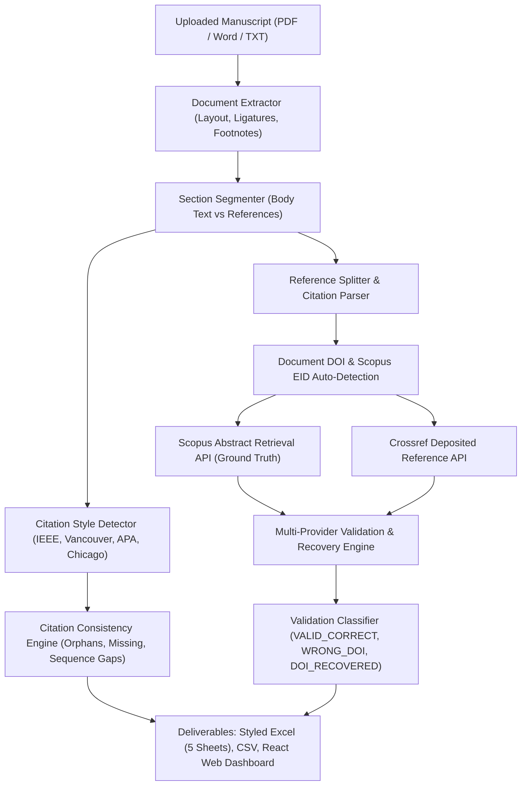

# Scholarly Reference Validation System
# Scholarly Reference Validation & Manuscript Audit Studio

An automated agentic research tool built to validate bibliographic references from Scopus exports, detect `VALID_DOI_WRONG_REFERENCE` discrepancies, verify HTTP resolution and paywall/bot access gates, recover missing DOIs, and generate multi-sheet Excel, CSV, and interactive web dashboard reports.
[](https://www.python.org/)
[](https://fastapi.tiangolo.com/)
[](https://react.dev/)
[](https://pytest.org/)
[](LICENSE)

An agentic scientometric intelligence system built to ingest academic manuscripts (PDF, Word DOCX/DOC, Text, Markdown, CSV, Excel), automatically detect and audit all worldwide in-text citation and reference styles, cross-reference against authoritative **Scopus** and **Crossref** ground truths, detect critical scientometric discrepancies (`VALID_DOI_WRONG_REFERENCE`), recover missing DOIs, and generate multi-sheet Excel, CSV, and interactive React web dashboard reports.

---

## 🌟 Key Features
## 🌟 Key Capabilities

1. **Robust Reference Segmentation (Phase 1)**
   - Overcomes overloaded semicolons using a token-buffer heuristic respecting multi-author citations and publication-year boundaries `(YYYY)`.
   - Preserves 100% of raw references (`raw_reference`) for auditability.
   - Identified **17,253 clean references** across 842 documents (averaging 20.5 references/doc).
### 1. Unified Multi-Format Manuscript Ingestion
- **PDF Extraction:** Layout-aware extraction preserving multi-column streams, handling hyphenated line breaks (`infor- / mation`), unicode font ligatures (`fi`, `fl`, `ff`), and hyperlink annotations (`/Annots`).
- **Word (DOCX/DOC) Parsing:** Direct paragraph streaming, table extraction, and footnote/endnote extraction (`[Footnote] 1. ...`).
- **Text & Markdown:** Native plaintext decoding with UTF-8 BOM support.
- **XML / Control Character Sanitization:** Strips illegal XML control characters (`\x00-\x08`, `\x0b`, `\x0c`, `\x0e-\x1f`) to ensure 100% crash resilience during Excel (`openpyxl`) and JSON generation.

2. **Multi-Provider Metadata Retrieval with SQLite Caching (Phases 3, 4, 5, 7)**
   - Integrates **Elsevier Scopus Search API**, **Crossref REST API**, and **OpenAlex REST API**.
   - Thread-safe local caching in `cache/api_cache.sqlite` ensures zero redundant HTTP calls.
### 2. Global Citation Style Classification & In-Text Auditing
Automatically detects the manuscript's dominant citation style family and extracts every in-text citation with surrounding sentence contexts:

3. **DOI Resolution & Accessibility (Phase 5)**
   - Traces redirect chains from `https://doi.org` and isolates true 404s.
   - Accurately distinguishes institutional paywalls / bot protection (HTTP 401/403) from genuinely broken URLs.
| Citation Style Family | Standard Journal Formats | In-Text Markers Handled | Reference Section Formats |
|---|---|---|---|
| **IEEE / Numeric Bracketed** | IEEE, Elsevier, ACM, Springer, Nature, Science, MDPI | `[1]`, `[1, 2]`, `[1-5]`, `[1–5]`, `[1, p. 25]`, `[1 0]` | `[1] Author, A. (2020)...` |
| **Vancouver / Superscript Numeric** | Vancouver, Lancet, JAMA, BMJ, Nature, ACS, AMA | `¹`, `¹⁻³`, `¹,²`, `¹²`, `³⁻⁵` | `1. Author, A. Title. Journal...` |
| **APA 7th & Harvard (Author-Date)** | APA, Harvard, SAGE, Springer Social Sciences | `(Smith, 2020)`, `Smith (2020)`, `(Smith & Jones, 2019)` | `Smith, A. (2020). Title...` |
| **Chicago Author-Date / Taylor & Francis** | Taylor & Francis, Chicago 17th, Library Science | `(Fagan 2014)`, `(Barba et al. 2013, 392)`, `(Google n.d.a)` | `Barba, Ian. 2013. “Title.” Journal.` |
| **Numeric Parenthetical** | Applied Math, Operations Research | `(1)`, `(1, 2)`, `(1–4)` | `(1) Author, A. Title...` |
| **Chicago Notes & Bibliography** | Law Reviews, Legal Studies, History | `[Footnote] 1.`, `¹` in body text | Composite alphabetical bibliography |

4. **Bibliographic Matching & Taxonomy Classification (Phases 6 & 8)**
   - RapidFuzz title similarity, author surname/initial matching, and compound scoring.
   - Detects the core scientometric failure mode: **`VALID_DOI_WRONG_REFERENCE`** (resolves to HTTP 200, but points to the wrong publication).
   - Recovers missing DOIs (`DOI_RECOVERED`) with high confidence or routes uncertain candidates to human review.
### 3. Citation Consistency Engine
Audits the structural integrity of the manuscript:
- **Orphan References:** Identifies references in the bibliography that are never cited in the body text.
- **Missing References:** Detects citations in the body text that lack a corresponding bibliography entry.
- **Sequence Gaps:** Detects skipped reference numbers in numeric styles (e.g., citing `[1]`, `[2]`, `[4]` without `[3]`).
- **Consistency Score:** Computes a normalized 0–100% manuscript consistency metric.

5. **Multi-Sheet Styled Excel & Interactive Web Dashboards (Phase 11)**
   - Generates `reference_validation_results.xlsx` with custom styling (Summary, Documents, All References, Human Review, Wrong DOI Cases).
   - Standalone browser dashboard: `reference_validation_report.html` (zero server required).
   - Full-featured interactive Streamlit dashboard: `dashboard.py`.
### 4. Dual-Pool Scopus & Crossref Ground Truth Verification
- **Dual-Pool Scopus Fallback:** Bypasses rate-limited Scopus Search APIs (`/content/search/scopus`, HTTP 429) by leveraging the separate **Scopus Abstract Retrieval API pool** (`/content/abstract/doi/{doi}?view=FULL`) to retrieve authoritative EIDs and 100% Scopus-linked references.
- **Crossref Deposited Reference Alignment:** Fetches publisher-deposited reference lists directly from Crossref metadata for independent validation.
- **Scientometric Discrepancy Detection:** Identifies `VALID_DOI_WRONG_REFERENCE` (resolves via HTTP 200, but points to a completely different paper).
- **Automated Missing DOI Recovery:** Recovers authentic DOIs using fuzzy title similarity (RapidFuzz token set ratio), author matching, and publication year verification.

6. **Machine Learning Calibration (Phase 12)**
   - Extracts 11-dimensional feature vectors (`FeatureExtractor`) and calibrated probabilities (`CalibratedClassifier`).
---

## 🏗️ System Architecture & Workflow



---

## 🚀 Quick Start & CLI Usage
## 🚀 Quick Start

All commands can be run using the pre-configured virtual environment:
### Prerequisites
- **Python 3.12+**
- (Optional) **Node.js 18+** if modifying the React frontend

### 1. Test External APIs
### 1. Clone Repository & Setup Virtual Environment
```powershell
.venv\Scripts\python.exe main.py test-apis
git clone https://github.com/Satyamgupta31/Scientometric-Audit-Studio.git
cd "Scientometric-Audit-Studio"

python -m venv .venv
.\.venv\Scripts\Activate.ps1
pip install -r requirements.txt
```

### 2. Run Reference Segmentation (Phase 1)
```powershell
.venv\Scripts\python.exe main.py phase1
### 2. Configure Environment Variables
Copy `.env.example` to `.env` and configure your API credentials:
```ini
ELSEVIER_API_KEY=your_elsevier_api_key_here
CROSSREF_MAILTO=your_email@university.edu
```
Outputs:
- `phase1_reference_level_v2.csv`
- `phase1_manual_review_sample.csv`

### 3. Run Explicit DOI Extraction (Phase 2)
### 3. Launch the Interactive Web Dashboard
```powershell
.venv\Scripts\python.exe main.py phase2
# Option A: Python launcher
.\.venv\Scripts\python.exe run_dashboard.py --port 8000

# Option B: Windows Batch script
.\start_dashboard.bat

# Option C: PowerShell script
.\run.ps1
```
Open your browser to **`http://localhost:8000`** to access the interactive React studio.

### 4. Run Reference Validation
Run a batch of documents (e.g. 20 documents):
---

## 💻 CLI & Batch Pipeline Usage

### 1. Test External API Connections
```powershell
.venv\Scripts\python.exe main.py validate --docs 20
.\.venv\Scripts\python.exe main.py test-apis
```

Run the entire 864-document dataset (resumable with 6 concurrent workers):
### 2. Audit an Individual Manuscript (PDF or Word)
```powershell
.venv\Scripts\python.exe main.py validate --full
.\.venv\Scripts\python.exe -c "
from src.pipeline.custom_runner import run_custom_audit
from pathlib import Path

b = Path('sample_paper.pdf').read_bytes()
res = run_custom_audit(uploaded_file_bytes=b, uploaded_filename='sample_paper.pdf')
print('Consistency Score:', res['document_diagnostics']['consistency_score'])
print('Scopus Linked:', res['stats']['scopus_linked'])
"
```

### 5. Launch the Interactive Dashboard
### 3. Run Batch Validation across Scopus Export Dataset
```powershell
.venv\Scripts\streamlit.exe run dashboard.py
# Validate 20 documents
.\.venv\Scripts\python.exe main.py validate --docs 20

# Run full resumable multi-threaded validation (864 documents)
.\.venv\Scripts\python.exe main.py validate --full
```
Or simply double-click `reference_validation_report.html` to view the self-contained dashboard in your web browser.

### 6. Run the Automated Unit Test Suite
### 4. Run the Automated Unit Test Suite
```powershell
.venv\Scripts\pytest.exe -v
.\.venv\Scripts\python.exe -m pytest tests/ -v
```

---

## 📂 Project Structure
## 🌐 REST API Reference

The FastAPI backend exposes comprehensive endpoints:

### `POST /api/custom-audit/run`
Upload a manuscript (PDF, DOCX, TXT, CSV, Excel) or provide a Scopus EID/DOI.
- **Request:** `multipart/form-data` with `file` or `application/json` with `{"scopus_input": "10.1016/j.inffus.2026.104702"}`.
- **Response:**
  ```json
  {
    "job_id": "job_e71993f955",
    "source_info": {
      "source_eid": "2-s2.0-84969135833",
      "source_title": "Tracking User Behavior with Google Analytics Events...",
      "source_doi": "10.1080/19322909.2016.1175330"
    },
    "stats": {
      "total_references": 13,
      "scopus_linked": 13,
      "scopus_unlinked": 0,
      "resolving_dois": 8,
      "recovered_dois": 8,
      "scopus_linked_pct": 100.0,
      "resolving_pct": 61.5
    },
    "document_diagnostics": {
      "citation_style": "AUTHOR_YEAR",
      "citation_style_display": "APA / Harvard Author-Year (Name, Year)",
      "total_in_text_citations": 18,
      "consistency_score": 100.0,
      "orphan_count": 0,
      "missing_count": 0,
      "sequence_gaps": []
    },
    "items": [...]
  }
  ```

### `GET /api/stats`
Returns aggregated dataset-level scientometric metrics.

### `GET /api/documents`
Returns paginated list of audited documents with compliance rates.

### `GET /api/references`
Returns reference-level validation records with status filters (`VALID_CORRECT`, `VALID_DOI_WRONG_REFERENCE`, `DOI_RECOVERED`, `INVALID_DOI`).

---

## 📊 Output Deliverables

Each manuscript audit generates structured deliverables stored in `outputs/custom_runs/`:
1. **Multi-Sheet Styled Excel Workbook (`.xlsx`):**
   - **Sheet 1: Summary:** Document metadata, audit metrics, and compliance rates.
   - **Sheet 2: Citation Style & In-Text:** In-text citation inventory, style classification, and sentence contexts.
   - **Sheet 3: All References:** Complete bibliographic breakdown with validation status, DOIs, Scopus IDs, and similarity scores.
   - **Sheet 4: Discrepancies & Wrong DOIs:** High-priority items requiring editorial attention.
   - **Sheet 5: Recovered DOIs:** DOIs recovered from Crossref/OpenAlex registries.
2. **Normalized CSV Export (`.csv`):** Machine-readable tabular reference inventory.
3. **Interactive Web Dashboard:** Live React view with searchable tables, status filtering, and visual badges.

---

## 📁 Repository Structure

```
d:/Research Automation Tool/
Scientometric-Audit-Studio/
├── .env                                         # API credentials (ELSEVIER_API_KEY, etc.)
├── .env.example                                 # Template for environment variables
├── requirements.txt                             # Pinned dependencies
├── .env.example                                 # Environment variable template
├── requirements.txt                             # Pinned Python dependencies
├── config.py                                    # Centralized settings & thresholds
├── main.py                                      # Primary CLI entrypoint
├── dashboard.py                                 # Streamlit interactive web dashboard
├── reference_validation_results.xlsx            # Multi-sheet styled Excel deliverable
├── reference_validation_report.html             # Standalone interactive HTML report
├── phase1_reference_level_v2.csv                # Phase 1 reference-level dataset
├── phase1_manual_review_sample.csv              # Phase 1 review sample
├── run_dashboard.py                             # FastAPI + React server launcher
├── start_dashboard.bat                          # One-click Windows batch launcher
├── run.ps1                                      # PowerShell launcher
├── pytest.ini                                   # Pytest configuration
├── workflow_diagram.png                         # Architectural flow diagram
├── Scholarly_Reference_Validation_System_Workflow.docx # Workflow specification document
│
├── data/
│   ├── input/scopus_export.csv                  # Scopus export (864 documents)
│   ├── intermediate/                            # Segmented & preprocessed CSVs
│   └── output/                                  # Final CSVs and Excel reports
├── src/
│   ├── parsing/                                 # Manuscript parsing & citation intelligence
│   │   ├── document_extractor.py               # PDF/Word text & metadata extraction
│   │   ├── section_segmenter.py                # Body text vs reference segmentation
│   │   ├── citation_style_detector.py          # Multi-style classifier & consistency auditor
│   │   ├── reference_splitter.py               # Boundary splitting (numbered & author-date)
│   │   ├── citation_parser.py                  # Field-level bibliographic parser
│   │   ├── doi_extractor.py                    # DOI extraction & URL normalization
│   │   └── normalizer.py                       # Unicode & title normalizers
│   │
│   ├── providers/                               # External registry clients
│   │   ├── scopus.py                           # Scopus Search & Abstract Retrieval client
│   │   ├── crossref.py                         # Crossref REST API client
│   │   ├── openalex.py                         # OpenAlex REST API client
│   │   └── base.py                             # SQLite caching provider base
│   │
│   ├── matching/                                # Fuzzy matching algorithms
│   │   ├── title_matcher.py                    # RapidFuzz title similarity matcher
│   │   └── author_matcher.py                   # Author surname/initial matcher
│   │
│   ├── validation/                              # Scientometric decision engines
│   │   ├── doi_validator.py                    # Core reference validator
│   │   ├── recovery.py                         # Missing DOI recovery heuristics
│   │   └── classifier.py                       # ML feature extractor & classifier
│   │
│   ├── pipeline/                                # Orchestration pipelines
│   │   ├── custom_runner.py                    # Custom manuscript audit orchestrator
│   │   └── runner.py                           # Batch dataset pipeline runner
│   │
│   ├── io/                                      # Data writers & exporters
│   │   └── writers.py                          # Resilient multi-sheet Excel & CSV writers
│   │
│   └── web/                                     # Web server backend
│       └── server.py                           # FastAPI application & REST APIs
│
├── cache/                                       # SQLite persistent caches
│   ├── api_cache.sqlite                         # External API response cache
│   └── checkpoints.sqlite                       # Resumable pipeline checkpoints
├── frontend/                                    # Interactive React Studio
│   ├── src/components/CustomAuditView.jsx       # Custom audit dashboard component
│   └── src/components/ReferenceTable.jsx        # Interactive reference data table
│
├── src/
│   ├── models/                                  # SourceDocument, ParsedReference, VerificationResult
│   ├── io/                                      # CSV loader, openpyxl writer, HTML generator
│   ├── parsing/                                 # Reference splitter, citation parser, DOI extractor
│   ├── providers/                               # Crossref, OpenAlex, Scopus, DOI resolver
│   ├── matching/                                # Title matcher, author matcher, compound scorer, ML
│   ├── validation/                              # URL checker, DOI validator, recovery engine
│   ├── review/                                  # Human review exporter
│   └── pipeline/                                # Standalone phase runners & master runner
│
└── tests/                                       # 21 comprehensive unit tests
└── tests/                                       # Comprehensive unit test suite
    ├── test_manuscript_pipeline.py              # Multi-style citation tests (37 tests)
    ├── test_classifier.py                       # ML classification tests
    ├── test_doi_extractor.py                    # DOI extraction tests
    ├── test_matching.py                         # Title & author matching tests
    └── test_scoring.py                          # Scoring & validation tests
```

---

## 📄 License

This project is licensed under the MIT License - see the [LICENSE](LICENSE) file for details.
